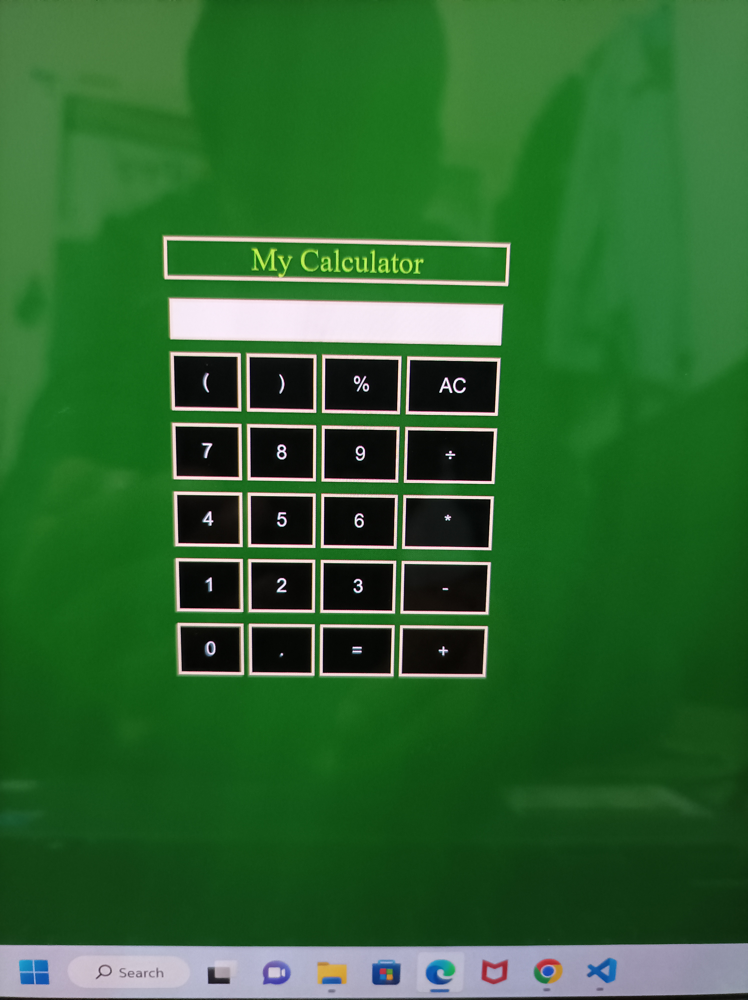
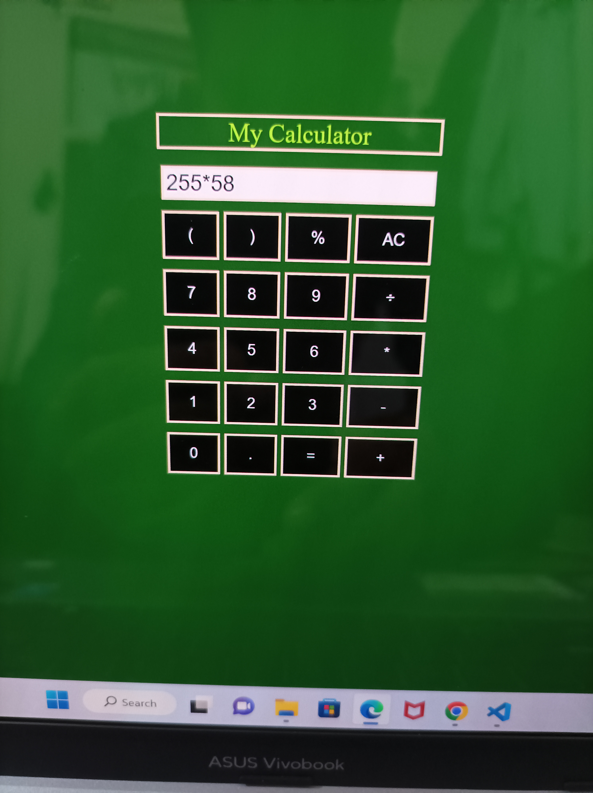
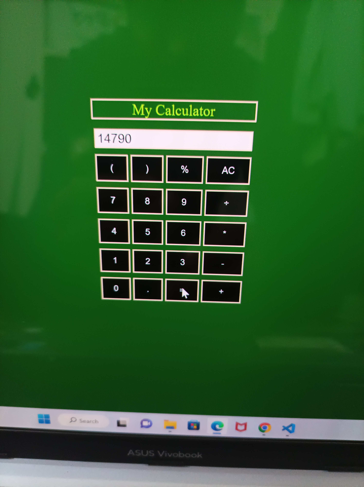
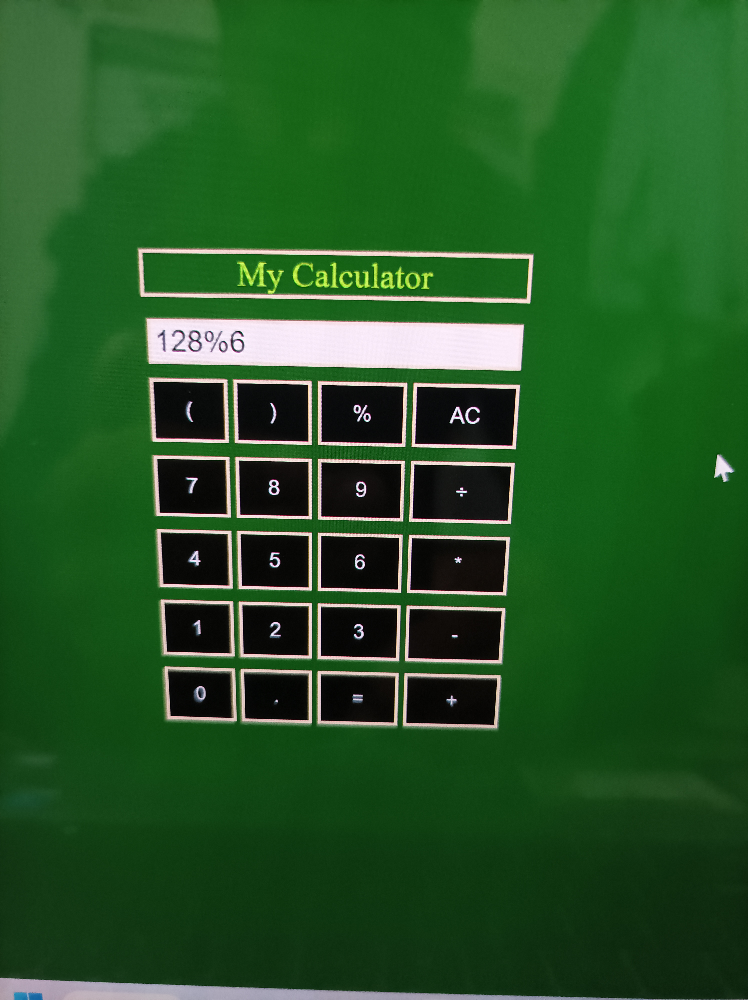
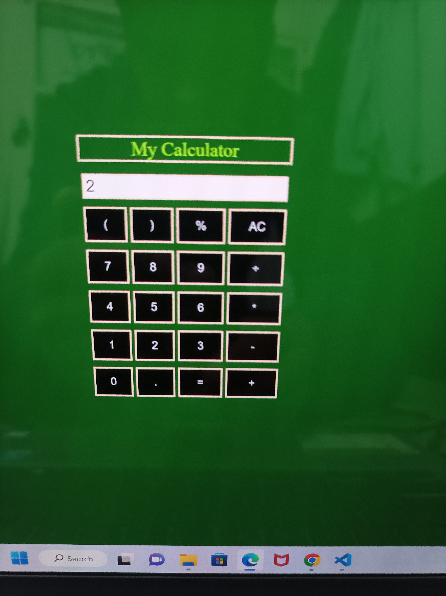

# Calculator

## The Calculator by using HTML, CSS and JAVASCRIPT. This Calculator will perform calculation like addition, subtraction, division, multiplication and also the remainder by  using % button.

## Output!:

# Multiplication operation between two numbers by using * button.

# After clicking on the = button the result is obtained on the bar.

# Final remainder left between two numbers can be calculated by using % button between two numbers. 

# After clicking on the = button the result is obtained on the bar.
